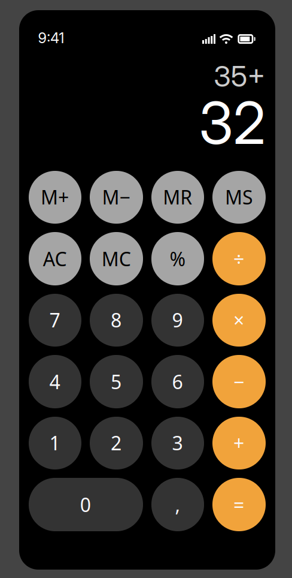
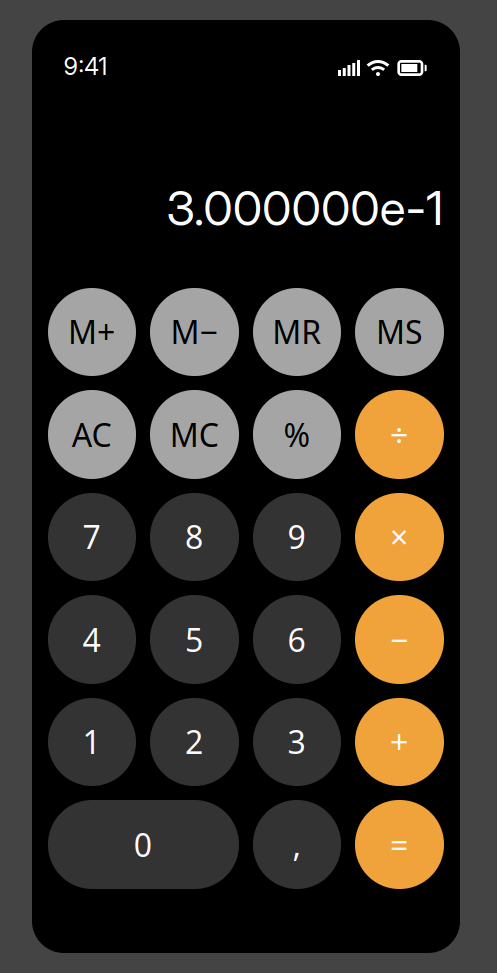
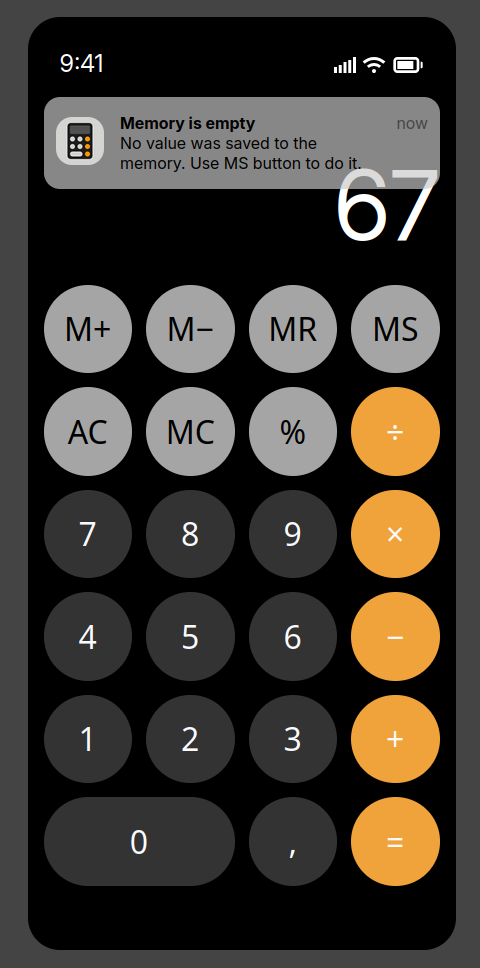

## Задание

> Создать приложение "Калькулятор" по макету, используя возможности языка JavaScript.
>
> Требования:
>
> - Кнопки “0-9 , ” должны появляться в поле ввода (там где сейчас написано 941).
> - AС - All Clean очищает поле ввода.
> - +, -, \*, /, % - реализуют соответствующие операции с числами.
> - = реализует выбранную операцию +, -, \*, / с введенными числами.
> - MS - Memory Save сохраняет числовое значение в “память”, если до этого было что-то сохранено, значение перезаписывается. Опционально: для сохранения введенных значений после перезагрузки страницы можно использовать localStorage.
> - MC - Memory Clear очищает память.
> - MR - Memory Read вызывает число из памяти и вставляет в поле ввода.
> - M+ - Добавление к числу в памяти.
> - M- - Вычитание из числа в памяти.

## Результат

Модульное приложение на Javascript с использованием Vite в качестве сервера для разработки.

#### Структура кода:

```sh
├── public # favicon
├── src # Модули
│   ├── assets # Иконки
│   ├── consts.js # Константы
│   ├── elements.js # Элементы DOM
│   ├── handlers.js # Обработчики (так вышло, что он один и не совсем обработчик)))
│   ├── memory.js # Память в localStorage
│   ├── notifications.js # Уведомления
│   └── style.css
├── main.js # Основной файл, взаимодействующий со всем подряд)
└── index.hmtl
```

#### Скриншоты

<p align="center">
  
</p>
<p align="center">
  Базовый интерфейс
</p>

<p align="center">
  
</p>
<p align="center">
  Отображение <b>сложнейшей</b> задачи 0.1 + 0.2
</p>

<p align="center">
  
</p>
<p align="center">
  Уведомления :)
</p>

<p align="center">
  
</p>
<p align="center">
  Такса
</p>
