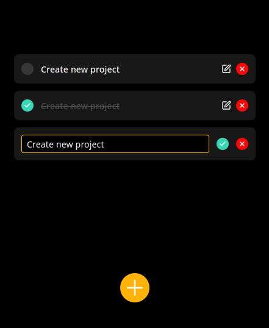

## Задание

Создать приложение TodoList по макету, используя возможности языка JavaScript.

## Требования:

- Сверстать интерфейс по макету, либо нарисовать свой и согласовать его с преподавателем.

- Реализовать функции на чистом JS: создание, удаление, редактирование записи; при нажатии на галочку текст должен зачеркиваться.
  - Создать функции:openModal() - отображение экрана создания записи.
  - createTask() - создание записи и помещение ее в массив, очистка поля ввода и скрытие экрана создания записи.
  - closeModal() - скрытие экрана создания записи.
  - deleteItem(id) - удаление элемента с уникальным id.
  - setDone(id) - изменение статуса записи на выполнено\не выполнено.
  - renderTodoList() - отображение элементов списка.

- Реализовать взаимодействие с localStorage.
  - setItem(key, value) – сохранить пару ключ/значение.
  - getItem(key) – получить данные по ключу key.
  - removeItem(key) – удалить данные с ключом key.
  - clear() – удалить всё.
  - key(index) – получить ключ на заданной позиции.
  - length – количество элементов в хранилище.

## Скриншоты

  

  

  

  

  Такса

