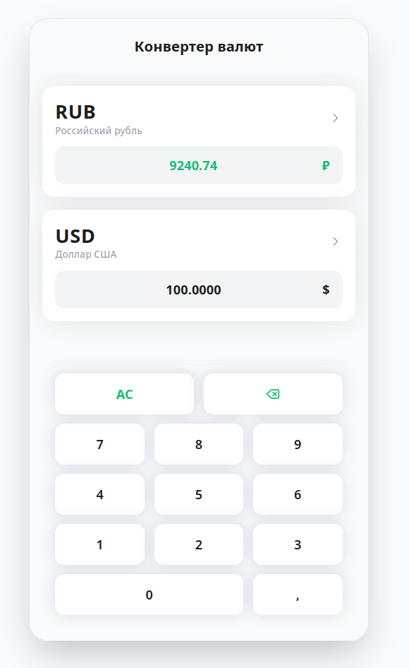
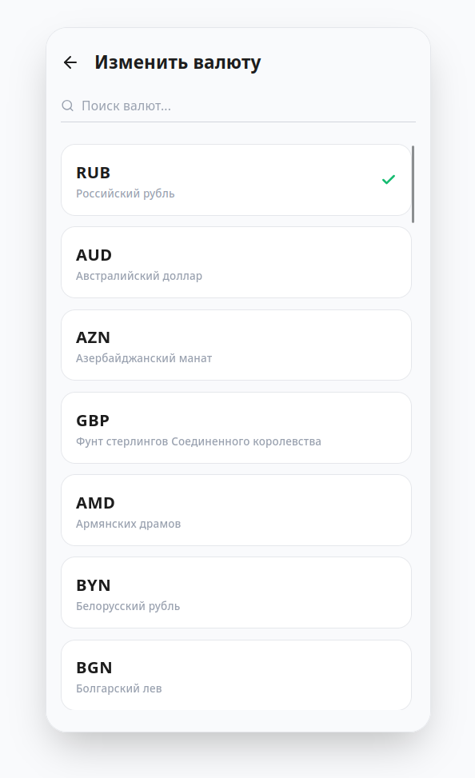
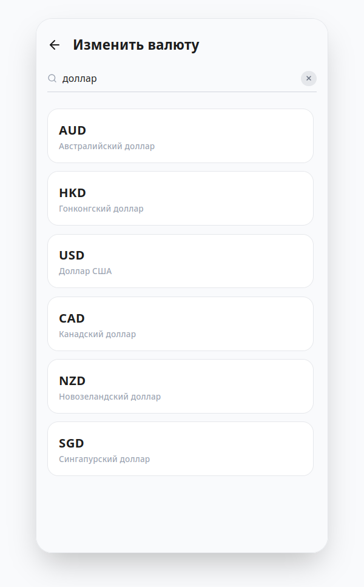

## Задание

Представлен макет приложения “Конвертер валют”. Необходимо сверстать интерфейс и реализовать функции.

## Требования:

1. Кнопки “0-9 , ” должны появляться в поле ввода (там где сейчас написано 7500₽ или 100$).
2. AС - All Clean очищает поле ввода.
3. Зеленым цветом обозначено активное поле ввода или выбранные валюты. На втором экране есть поле поиска, его сделать через функцию js filter(). Фильтрация должна работать после каждого изменения поля ввода input.addEventListener('change', (e)=>{...}).
4. Используйте готовые данные для работы с валютами, достаточно просто скопировать их себе в проект и можно начинать с ними работать.

## Скриншоты

  

  

  

  

